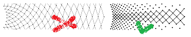
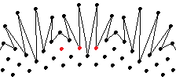
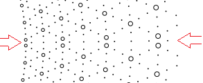

# Table of content
* [Introduction](#introduction)
* [Print preview](#print-preview)
* [Form fields](#form-fields)
  * [Angles](#angles)
  * [Diameters](#diameters)
  * [Dots per ring](#dots-per-ring)
  * [Pattern of dots](#pattern-of-dots)
* [Vierge](#Vierge)

# Introduction

The diameter of the concentric circles in common polar grids increases at a constant rate, as shown on the left. DiBL generates grids with a consistent shape of the stitches as shown on the right.

This article is a help page for the [web-based polar grids](index).
With the InkScape plug-in version you gain functionality but loose examples.

Source code: [script], [page], see also [Hands-on Scala.js](https://lihaoyi.github.io/hands-on-scala-js/#GettingStarted) (the script language)

[script]: https://github.com/d-bl/polar-grids/tree/master/src/main/scala/dibl
[page]: https://github.com/d-bl/polar-grids/tree/master/docs/index.html

# Print preview

Use the print preview function of your browser to select the page with the grid. Print with landscape orientation to get the full URL. Thus you get the information to reproduce the grid on the sheet.

# Form fields

## Angles

Ulrike Löhr specifies the angles relative to the top of a patch of lace, while this application applies the angle to the footside of the doily edging. So we have to subtract Ulrike's angles from 90 degrees.

## Diameters

The unit for the diameters is mm when printed at 100% or 90 [DPI]. The size on screen might vary from monitor to monitor. The actual inner value might be larger.

[DPI]: https://en.wikipedia.org/wiki/Dots_per_inch

## Dots per ring

A dotPattern may introduce repeat factors. The desired pattern of lace may also introduce repeat factors. The fan example illustrates a repeat factor of three with the red dots. The number of dots should be a multitude of the repeat factor(s) to prevent irregularities where the end of the grid or piece of lace meets the the start. The start of the grid is the horizontal axis on the right side. Keep an eye on that section (illustrated with the red arrows) to get the repeat factor right.

## Pattern of dots

The pattern defines whether and how dots are plotted. Each sequence of digits applies to one ring of dots. A zero means skip the dot, a one means plot as a normal dot, a two means plot as a circle. Each sequence of digits introduces a repeat factor equal to the length of the sequence.

# Vierge

The script plots dots (either real ones or circles) but does not connect the dots. The examples use circles for the inner dots to make the pattern easy to recognise. In case you need real dots for an accurate pricking, replace the two’s in the 'pattern of dots' by one's.

